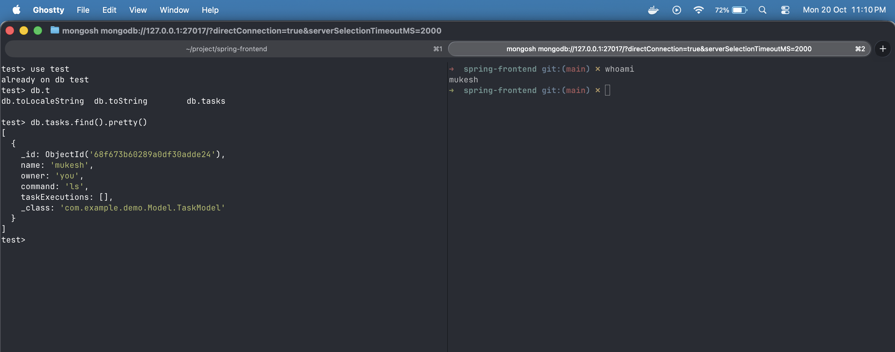
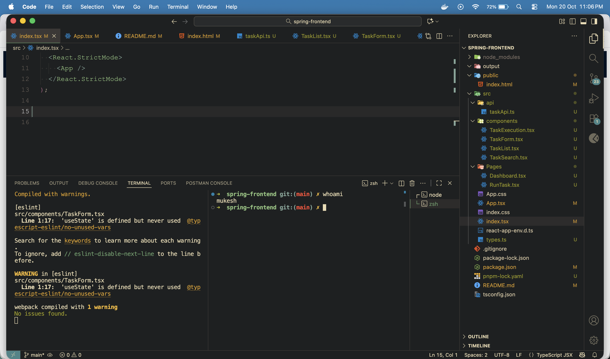

# Spring Boot Task Manager with Kubernetes & React Frontend

This project implements a task management system where each task represents a shell command that can be executed inside a Kubernetes pod. The application provides a REST API backend using **Spring Boot**, stores data in **MongoDB**, and has a **React + Ant Design** frontend for UI interaction.

---

## Folder Structure

```yaml
demo-frontend/
├── package.json
├── pnpm-lock.yaml
├── public/
│   └── index.html
└── src/
    ├── api/
    │   └── taskApi.ts
    ├── components/
    │   ├── TaskList.tsx
    │   ├── TaskForm.tsx
    │   ├── TaskSearch.tsx
    │   └── TaskExecution.tsx
    ├── pages/
    │   ├── Dashboard.tsx
    │   └── RunTask.tsx
    ├── App.tsx
    ├── index.tsx
    └── react-app-env.d.ts
```

---

## Prerequisites

- Node.js 20+
- pnpm
- React 19
- Ant Design v5
- Backend API running at `http://localhost:8080`

---

## Setup and Run

1. **Install dependencies:**

```bash
pnpm install
```
- Start the development server
```bash
pnpm dev
```
- locally run on : *http://localhost:3000*
## API Integration

The frontend communicates with the backend via **Axios** (`src/api/taskApi.ts`).

### Endpoints

- `GET /tasks` – List all tasks
- `GET /tasks/{id}` – Get task by ID
- `POST /tasks` – Create a new task
- `PUT /tasks` – Update a task
- `DELETE /tasks/{id}` – Delete a task
- `PUT /tasks/{id}/run?namespace=&podName=&containerName=` – Run task inside Kubernetes pod

> **CORS:** Ensure CORS is enabled in the backend (`@CrossOrigin(origins = "*")` or global config).

---

## Features

- Create, update, delete, and search tasks.
- Run tasks inside Kubernetes pods and view the output.
- Displays execution start and end times.
- Uses TypeScript models for `Task` and `TaskExecution`:

```ts
export interface TaskExecutionModel {
  startTime: string;
  endTime: string;
  output: string;
}

export interface TaskModel {
  id?: string;
  name: string;
  owner: string;
  command: string;
  taskExecutions?: TaskExecutionModel[];
}
```
## References

- React 19
- Ant Design v5
- Axios
- TypeScript

---

## Backend Repository

The Spring Boot backend for this project is available at:

[https://github.com/mukesh1352/spring_CRUD.git](https://github.com/mukesh1352/spring_CRUD.git)

## SCREENSHOTS
## Screenshots

### Create Task


### Task Running / Output

